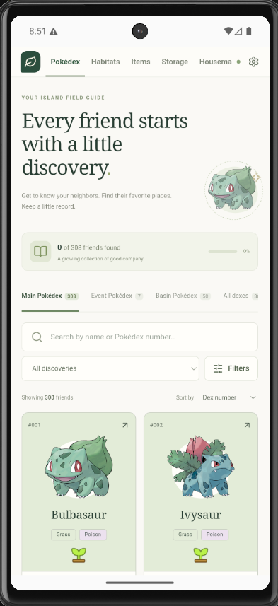
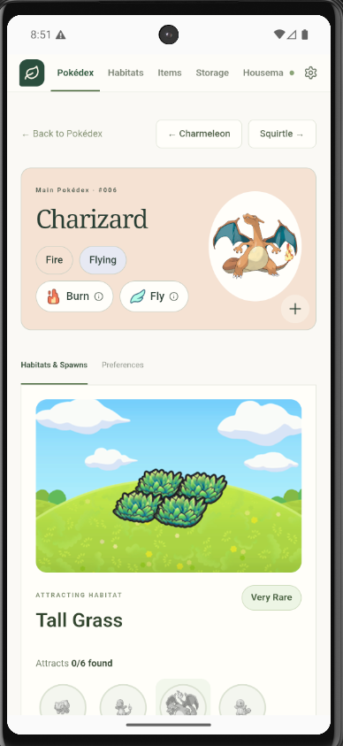
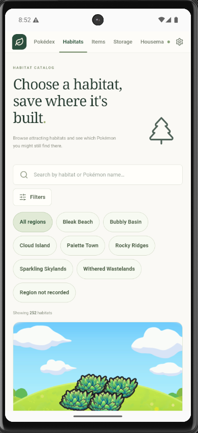
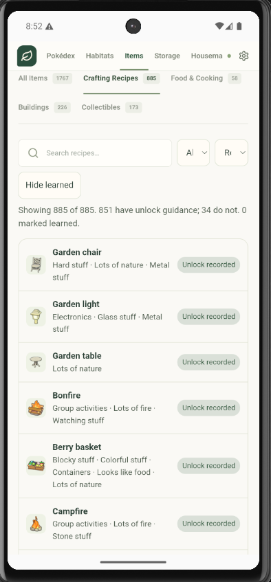
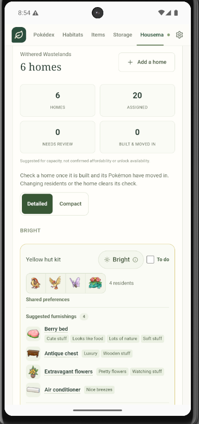
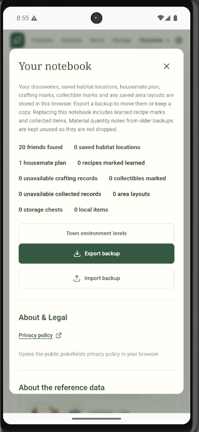

# Pokopia Fieldnotes

A responsive, local-first Pokémon Pokopia companion: searchable Pokédex and a Cozy Planner. React + TypeScript + Tailwind, built with Node/Vite for Cloudflare Pages.

## Screenshots

| Pokédex | Pokémon details |
|---|---|
|  |  |
| **Habitat catalog** | **Crafting recipes** |
|  |  |
| **Homes planner** | **Local notebook** |
|  |  |

## Run

Use Node 22 (see `.node-version`).

```sh
npm ci
npm run dev
npm test
npm run build
npm run preview
```

`npm run dev` and `npm run build` both bake species/habitat/item images into `public/images/` first (existing files are skipped). The first run downloads about 90 MB; later starts reuse that folder. Vite serves those same `/images/…` paths locally and in production.

`dist/` is the deployable site. No server, API key, database service or paid backend is required. Progress lives in IndexedDB in the current browser. Export/import JSON backups through **My notebook** to transfer devices. Clearing browser data removes local saves.

## Features

- Main, event and basin dexes; name/number search; discovery, found-area, spawn-area, specialty, type, time and weather filters; number/name sorting.
- Separate found marks for every area, including Pokémon found in multiple places.
- Detail tabs for facts, attracting habitats/requirements, preferences and progress.
- Items: a directory of catalog items with Crafting Recipes, Food & Cooking, Buildings and Collectibles tabs. Recipe pages still show how a recipe is unlocked and where materials come from. Learned marks and collectible marks are manual filters only. Coverage numbers live in `docs/research/crafting-audit.json`.
- Planner uses the selected area's found roster, optional exclusions, a rectangular block plot, supported building kits and quantity limits.
- Deterministic groups based on matching environments and shared favorite categories. These are furnishing recommendations, not a friendship simulation or proof of an optimal layout.
- Homes respect footprint, capacity and kit limits. Drag to move, edit coordinates, move/swap residents, inspect construction/comfort requirements and see unplaced Pokémon.
- One saved layout per area; discovery/catalog changes flag the old plan without overwriting edits.
- Production app shell, catalog and baked species/habitat/item artwork work offline after a successful first visit. Unavailable images have a text fallback.

## Modules

| Directory | Responsibility |
|---|---|
| `src/catalog` | Typed normalized reference data and provider |
| `src/dex` | Filtering, cards and detail views |
| `src/crafting` | Recipe catalog adapter and recipe-detail UI |
| `src/items` | Items directory, tabs, item detail |
| `src/progress` | Shared discovery/plan state and serialized persistence |
| `src/planner/engine.ts` | Pure grouping, placement, furnishings and swap rules |
| `src/planner/worker.ts` | Background plan computation |
| `src/planner/HomeDetail.tsx` | Construction, care and roommate editing |
| `src/persistence` | IndexedDB and backup validation |
| `src/ui` | Shared dialogs, portraits and discovery controls |
| `scripts` | Source import and production offline-cache generation |
| `tests` | Domain, persistence and imported-data regression checks |

## Reference data

`public/data/catalog.json` is a versioned build-time snapshot, not a live API dependency. `npm run data:import` refreshes the normalized snapshot from pinned PokopiaAPI records and Serebii factual tables. `npm run images:bake` (also part of `npm run build`) downloads species artwork, habitat photos and item icons into `public/images/` so the app serves them from this origin. That folder is gitignored; bake on each machine or CI job. HTML requests are limited to three at a time and cached under `.cache/sources`; remove that cache explicitly to refresh the same URLs. Review changes and bump the catalog version before shipping a new data snapshot.

- [PokopiaAPI](https://github.com/QuesoCaliente/pokopiapi), pinned at `893936af1adb51f6d2aab18aa8fa359fc401dd0a`: stable IDs, dex membership and base metadata. BSD-3-Clause notice is in `public/data/POKOPIAPI-LICENSE.txt`.
- [Serebii Pokopia](https://www.serebii.net/pokemonpokopia/): independently extracted factual preference categories, item associations, spawn conditions, habitat requirements and building dimensions/capacities/materials. Individual source links are retained in the catalog and UI. Habitat and item pictures used in the app are fetched at bake/build time from the same public item/habitat image URLs.
- [PokeAPI sprites](https://github.com/PokeAPI/sprites): reference species artwork, baked into `public/images/pokemon/` at build time. Form-specific in-game appearances may differ; the portrait tooltip says this.

Pokémon names and artwork remain the property of their respective owners. This is an unofficial fan project, unaffiliated with Nintendo, Game Freak, Creatures or The Pokémon Company. The API code license does not grant ownership of Pokémon artwork.

The catalog also records, per item, the sections the Serebii item index lists it under (`groups`) and membership in a numbered set such as the music discs (`collection`). Item descriptions are not imported; only facts derived from them, such as a disc's number. Build kits include non-residential structures, marked `kind`; a kit is only offered to the planner when it is a documented residence with a recorded footprint and capacity, so structures and kits whose figures the source never records are listed but never placed. Coverage, unsorted items and undocumented kit figures are enumerated in `docs/research/import-report.json`.

Items may also carry `tags` (`scripts/tag-items.mjs`, run via `npm run data:tag`): theme labels such as Fire, Flying or Seasonal & holiday, assigned by keyword-matching each item's name. Unlike `groups` and `collection`, these are not independently extracted facts — they are a heuristic browsing aid for the Items tab search, shown separately in the UI, and reviewable in `docs/research/tag-report.json`.

Known boundaries: den kits are excluded because their size eligibility is not modeled. Two item icons (`coppeingot`, `gold`) 404 upstream and fall back to text. The grid checks footprints, not doors, paths, terrain, interior layout, furnishing reach, unlocks or comfort levels. Construction helpers are distinct from resident capacity. Food guidance for Frillish/Jellicent distinguishes male/female flavors within the species entry. Special encounters without recorded attracting habitats link to their reference rather than inventing a recipe.

## Cloudflare Pages

For a connected repository, configure build command `npm run build`, output directory `dist`, and Node version `22`. For direct upload:

```sh
npx wrangler login
npm run deploy
```

The deploy script targets the Pages project `pokefields`, served at `https://pokefields.pages.dev/`. `wrangler.jsonc` contains only non-secret build configuration. Do not commit credentials.

The production web deployment is live at `https://pokefields.pages.dev/`. Privacy and support pages are deployed separately at `https://pokefields-privacy.pages.dev/`.

Pushes to `main` run the GitHub Actions workflows in `.github/workflows/`. The Cloudflare Pages workflow tests and builds the web app, stores `dist/` as a 14-day workflow artifact, and deploys it to the `pokefields` Pages project. It requires the repository secrets `CLOUDFLARE_API_TOKEN` and `CLOUDFLARE_ACCOUNT_ID`. The Android workflow builds a signed release APK on `main` and stores `pokefields-release-apk` as a 30-day workflow artifact. Pushing a `v*` tag also publishes that signed APK as a persistent GitHub Release download. Pull requests build a debug APK and run both checks without deploying to Cloudflare or publishing a release.

See `docs/pokopia-companion-plan.md` for scope and research decisions. Crafting coverage, licensing, and remaining data gaps are in `docs/research/crafting-audit.json` and `docs/research/crafting-licensing.md`. Navigation continuity notes are in `docs/navigation-ux.md`.
