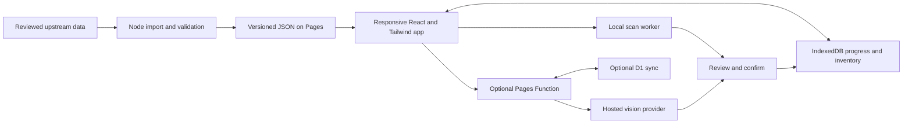

# Pokopia companion: research and implementation plan

Research date: 8 September 2026. Scope originally: planning and source inspection only. **Status updated 8 September 2026: implementation has since started — see "Status" below.**

[Likely] The highest-value product is an inventory-aware companion: find a Pokémon, choose its habitat, see what is missing, and locate the materials already in storage. Screenshot extraction should reduce bookkeeping without silently corrupting counts.

## Status (as of 2026-09-08)

[Certain] The project shipped as **Pokopia Fieldnotes** — a React + TypeScript + Vite + Tailwind app (`src/`), built with `tsc -b && vite build`, tested with Vitest (29 tests passing across `tests/core.test.ts` and `tests/catalog.test.ts`), and producing a working `dist/` build with an offline app shell. Verified locally by running `npm test` and `npm run build` on Node 22.

Built so far, against the Phase 1 exit conditions in section 8:

- **Data import (Phase 0)**: `scripts/import-data.mjs` produced a versioned `public/data/catalog.json` (365 Pokémon, 365 preference records, 252 habitats, 715 items, 26 building kits, no reported import failures — see `docs/research/import-report.json`). Sourced from pinned PokopiaAPI plus independently extracted Serebii facts, per `README.md`.
- **Pokédex (P0)**: implemented in `src/dex/` — search, filters, sorting, per-area found tracking, detail tabs for facts/attracting habitats/preferences/progress. Habitat/attraction detail lives inside Pokémon detail views rather than as a separate standalone "Habitat dex" section.
- **Cozy Planner (section 10 feature, elevated to P0 in this plan)**: implemented in `src/planner/` (`engine.ts`, `worker.ts`, `PlannerPage.tsx`, `HomeDetail.tsx`) — area/roster selection, deterministic grouping by environment and shared favorites, rectangular placement against kit footprint/capacity, drag-to-move, construction/comfort requirement views, one saved layout per area with staleness flags on catalog changes.
- **Durable local progress (P0)**: implemented in `src/persistence/store.ts` (IndexedDB via Dexie) and wired through `src/progress/context.tsx`; JSON export/import backup-and-restore is in `App.tsx`, with size and shape validation before replacing local state.
- **Deployment**: **done**. `wrangler.jsonc` and the `deploy` script target the Cloudflare Pages project `pokefields`, served at `https://pokefields.pages.dev/`. The previous Pages project was retired after the replacement URL was verified.

Not started yet, despite being P0 in section 3's priority table:

- **Item and storage tracker** — no per-container/page inventory model or UI exists in `src/`.
- **Screenshot import (scanner)** — no OCR, icon-matching, or scan-review code exists (no Tesseract.js/OpenCV.js dependency, no `scan`-named module). Section 4's design is unimplemented.

In effect, the team built the Dex + Cozy Planner slice (originally scoped for Phase 1) ahead of the storage tracker and screenshot scanner (originally scoped P0/Phase 0–2), and has not yet deployed. The rest of this document is the original research and plan, kept as-is below; treat its "no application has been built" framing and the phase table in section 8 as superseded by this status note.

Confidence notation: [Certain] means directly observed evidence or a documented platform capability; [Likely] means a recommendation or strong inference; [Guessing] means an estimate or untested hypothesis. Record counts below describe source files, not independently verified game completeness.

## 1. Sources we can use or investigate

| Source | Verified format and coverage | Proposed role | Reuse and quality status |
| --- | --- | --- | --- |
| [PokopiaAPI repository](https://github.com/QuesoCaliente/pokopiapi) | [Certain] JSON files for Pokémon and items; REST route implementations; translation dictionaries; image URLs | [Likely] First candidate for a versioned dex/item import | [Certain] Repository declares BSD-3-Clause; upstream game data and image provenance still need separate review |
| [Pokémon JSON](https://raw.githubusercontent.com/QuesoCaliente/pokopiapi/893936af1adb51f6d2aab18aa8fa359fc401dd0a/src/data/pokemon.json) | [Certain] 365 records; no duplicate slugs; 5 missing image URLs | [Likely] Dex identity, specialties, availability and habitat associations | [Certain] 57 records explicitly marked partial; 308 omit dataStatus. Missing status is not verification |
| [Item JSON](https://raw.githubusercontent.com/QuesoCaliente/pokopiapi/893936af1adb51f6d2aab18aa8fa359fc401dd0a/src/data/items.json) | [Certain] 1,767 records; 850 have a nonempty craftingRecipe; 26 lack image URLs; no duplicate slugs | [Likely] Item catalog, acquisition references and recipe candidates | [Certain] 265 explicitly partial records. A populated recipe is not proof of complete ingredients or yield |
| [PokopiaPlanning](https://github.com/JEschete/PokopiaPlanning/tree/main/reference) | [Certain] CSVs for habitats, items, Pokémon, locations, favorites and specialties | [Likely] Cross-checks and habitat import candidate | [Certain] GitHub reported no repository license. Do not treat this as an approved redistribution source |
| [Habitat CSV](https://github.com/JEschete/PokopiaPlanning/blob/main/reference/Habitats.csv) | [Certain] 252 rows in the fetched file; Catalog, Number, Name, Description, Source URL columns | [Likely] Numbering and source-link index | [Certain] It lacks structured item-quantity columns; a planner needs additional normalization |
| [Xzonn database](https://github.com/Xzonn/PokemonPokopiaDatabase/tree/master/data) | [Certain] TSV-like .txt data parsed by TypeScript; habitat names include English/Japanese/Chinese; requirements and spawns have parsable delimiters | [Likely] Strong habitat cross-check candidate | [Certain] Repository declares GPL-3.0. Requirements use Chinese names and include category/terrain conditions; assess reuse scope before importing |
| [Serebii habitat reference](https://serebii.net/pokemonpokopia/habitats.shtml) | [Certain] Habitat listings and linked detail pages | [Likely] Verify disputed requirements and canonical English names | [Likely] Use links and independently checked facts; bulk copying text/images requires a source-policy review |
| [Pokopia Builder sources](https://github.com/appleforever11/pokopia-builder/blob/main/DataSources/POKOPIA-SOURCES.md) | [Certain] Catalog documentation reports 948 items, 714 recipes and 213 habitats | [Likely] Discovery/reference only | [Certain] The pipeline depends partly on assets from a local Pokopedia application bundle; GitHub reported no license |
| [Snickdx Pokopia Pal license](https://github.com/Snickdx/pokopia-pal/blob/main/LICENSE) | [Certain] License grants MIT terms for original application code, explicitly excluding game data/assets | [Likely] Inspect design ideas only | [Certain] Data files were still accessible despite the license saying catalogs were excluded; their presence does not resolve reuse |
| [PokoPal](https://github.com/beckettech/PokoPal) | [Certain] Public companion source and data directories | [Likely] Competitive reference only | [Certain] README explicitly calls the project proprietary |
| [PokéAPI](https://pokeapi.co/docs/v2) | [Certain] General Pokémon REST data, species, types and sprite references; asks clients to cache responses | [Likely] Optional species metadata enrichment | [Certain] Its habitat endpoint describes general Pokémon habitats. It is not a source for Pokopia build recipes |

[Certain] The source audit is saved in [research/source-audit.json](research/source-audit.json), including the pinned commit, file hashes, counts and observed gaps. Only audit metadata was saved, not a redistributed game catalog.

[Certain] The PokopiaAPI homepage advertises 311 Pokémon, while the inspected repository files contain 365. [Likely] Treat website totals as scope-dependent and potentially stale. Reconcile catalog, event, expansion and form rules before showing completion percentages. [Homepage](https://pokopiapi.com/en/)

## 2. API details and unresolved access

[Certain] The route source defines the following paths under the documented `/api/v1` prefix:

```text
GET /pokemon?page=1&limit=100
GET /pokemon/bulbasaur
GET /pokemon/filters
GET /pokemon/stats
GET /items?page=1&limit=100
GET /items/honey
GET /items/filters
GET /items/stats
```

[Certain] Pokémon filters include specialty, habitat, zone, climate, dex, contentSource, event and search. Item filters include category, tag, search, contentSource, event and recipeStatus. The item routes are marked experimental. Numeric Pokémon lookup uses national number, not local dex number. [Pokémon routes](https://github.com/QuesoCaliente/pokopiapi/blob/main/src/routes/pokemon/pokemon.route.ts), [item routes](https://github.com/QuesoCaliente/pokopiapi/blob/main/src/routes/items/items.route.ts)

[Certain] The live endpoint could not be validated here: Python reported certificate validation failure, and curl returned a Zscaler intermediary 403 HTML response. This is not evidence that the upstream service is down. Production CORS, authentication behavior, rate limits, deployed version and uptime remain unverified.

[Likely] Prefer build-time downloads from pinned revisions after reuse review. Publish normalized JSON with our app; keep a last-known-good catalog and review source diffs before release. Do not make every player's search depend on this external API.

[Certain] The raw Pokémon sample uses Spanish values for several fields, and the English dictionary includes multiple habitat aliases. [Likely] Join through our IDs and source mappings, never a translated display name. Validate English game names against a second source. [Translations](https://github.com/QuesoCaliente/pokopiapi/blob/main/src/data/translations/en.json)

[Certain] Official material distinguishes the free Dive update from the Bubbly Basin expansion. [Likely] Store free updates, events and paid content separately; default progress to the content the player has enabled. Do not count every underwater entry as base-game content. [Official update](https://pokopia.pokemon.com/en-us/update/)

## 3. Product scope

[Likely] Updated priority: **Cozy Planner**, the area-and-roster home planner described in section 10, is a core feature. Deliver a basic explainable grouping and needs checklist in Phase 1; expand its inventory-aware optimization in Phase 3.

[Likely] Use five main destinations: Dex, Habitats, Storage, Planner and More. Make Scan a prominent action within Storage and on the home screen. The item catalog should be reachable from Storage and global search.

| Priority | Feature | Player benefit and scope |
| --- | --- | --- |
| P0 | [Likely] Pokédex | Search; filter by specialty, area, time/weather and enabled content; track seen/befriended; favorites; notes; linked habitats |
| P0 | [Likely] Habitat dex | Search by habitat or desired Pokémon; show requirements, placement conditions, known spawns; track planned/built per world and area |
| P0 | [Likely] Item and storage tracker | Quantities per named container/page, global totals, item variants, location notes, quick edits and last-confirmed timestamps |
| P0 | [Likely] Screenshot import beta | Upload screenshots in a batch; choose container/page; review slot matches and quantities; commit once; undo |
| P0 | [Likely] Basic planner | Select a habitat; show owned/missing items and which containers hold them; distinguish materials ready from placement/unlock requirements |
| P0 | [Likely] Durable local progress | Offline reference after caching, IndexedDB saves, JSON backup/restore, schema migrations and separate save profiles |
| P1 | [Likely] Project shopping lists | Multiple habitats/recipes, ingredient expansion, recipe output quantities, shared demand and reservations |
| P1 | [Likely] Phone-camera import | Perspective correction, blur/glare checks, crop guides and explicit retake requests |
| P1 | [Likely] Cross-device sync | Optional account, reliable offline queue, conflict handling and deletion; mobile support alone does not provide sync |
| P1 | [Likely] Next useful habitat | Rank by missing Pokémon and material shortfall; explain the ranking and respect spoiler settings |
| P2 | [Likely] Additional collections | Recipes learned, event checklists, records, housing favorites and manually started timers |

[Likely] Make spoiler preferences available at first use: full reference or hide undiscovered entries. Hidden names and pictures must also stay out of search suggestions and recommendation explanations.

[Certain] Pokopia Tracker already exposes a buildable-habitat filter. Tangrome documents storage boxes, quantities, location pins and storage-aware build plans. [Likely] Fast, trustworthy screenshot updates are a promising differentiator; a generic dex and checklist alone offer less differentiation. This research did not establish that no competitor has a scanner. [Pokopia Tracker](https://pokopia.dev/habitats), [Tangrome](https://tangrome.com/)

## 4. Screenshot extraction design

[Likely] A screenshot can show visible item stacks; it cannot establish everything a player owns across unseen pages and containers. Label results as tracked inventory with scope and last-confirmed time.

[Certain] Nintendo supports transferring Switch 2 album screenshots to the Nintendo Switch App and saving them on a phone. [Likely] Make this clean screenshot path the initial recommendation; offer camera capture separately. Do not assume access to a Nintendo account or private screenshot API. [Nintendo transfer guide](https://www.nintendo.com/en-gb/Support/Troubleshooting/How-to-Download-or-Share-Screenshots-and-Videos-from-the-Nintendo-Switch-App-2843768.html)

[Likely] Proposed scan flow:

1. Select save profile, storage box and page; choose screenshot(s) or camera.
2. Check resolution and orientation; crop the inventory panel; preserve enough detail to read digits. Distinguish storage and backpack panels explicitly.
3. Detect slots and separate icon regions from quantity labels. Learn supported layouts from actual screenshots rather than hardcoding assumed grid dimensions.
4. Match icons against a reviewed, versioned reference library; OCR the number region. Keep item identity and quantity confidence separate.
5. For ambiguous slots, present candidate items and an editable count; allow Unknown. An unreadable number must not silently become zero or one.
6. Show old/new totals and the exact scope being replaced. Review ambiguous cells and confirm the import.
7. Commit atomically with an import ID, source image hash, capture time, coverage and revision; recompute totals; provide undo.

| Approach | Evidence | Recommendation |
| --- | --- | --- |
| Browser OCR | [Certain] Tesseract.js runs in browsers and Node through WebAssembly | [Likely] Baseline for count/name text. OCR alone cannot identify arbitrary item artwork. Lazy-load in a Web Worker |
| Icon matching | [Certain] OpenCV.js documents template matching | [Likely] Test on normalized slot crops; maintain templates for variants and selection states. Reference artwork may differ from storage icons |
| Hosted vision | [Certain] Gemini documents image input and structured JSON output | [Likely] Compare as an optional fallback using catalog candidate IDs and crops. JSON conformance does not prove a correct item or count |

Sources: [Tesseract.js](https://github.com/naptha/tesseract.js), [OpenCV.js](https://docs.opencv.org/4.13.0/d8/dd1/tutorial_js_template_matching.html), [image input](https://ai.google.dev/gemini-api/docs/image-understanding), [structured output](https://ai.google.dev/gemini-api/docs/structured-output).

[Guessing] A hybrid local matcher/OCR with optional hosted fallback may offer the best balance of cost, privacy and coverage. There is no Pokopia-specific accuracy evidence from this research; no model has been run against storage screenshots.

[Likely] Inventory correctness rules:

- Repeating a confirmed scan of the same container/page replaces that scope rather than adding it again.
- A partial crop updates only explicitly covered slots. Unseen slots are never cleared.
- An explicitly recognized empty slot differs from an unknown/unreadable slot.
- Two different boxes with identical contents are legitimate. Image similarity warns about duplication but cannot decide container identity.
- Overlapping screenshots require page/slot alignment. A scroll position or selected filter is not automatically a stable page identity.
- After sorting or rearranging a container, require a complete replacement scan if slot positions cannot be reconciled safely.
- A known craft or transfer is a separate user-confirmed transaction; planning alone does not consume materials.
- Keep variant quantities separately; aggregate to a base item only for requirements that allow substitution.
- Reject a stale replacement when the container changed during scanning; show a conflict instead of overwriting a newer edit.
- Keep a named unlocated/manual bucket for totals without known storage location. Do not add an aggregate count on top of its component boxes.

[Likely] Pilot with 30–50 representative screenshots and separately collected phone photos. Include empty/single/max stacks, repeated icons, lookalike variants, selected cells, overlays, different pages, storage versus backpack, image compression and glare. Split evaluation by capture session so near-duplicates cannot inflate accuracy.

[Likely] Proposed release targets, not measured results: at least 98% exact item-and-quantity matches among accepted cells on supported clean screenshots, with coverage reported alongside accuracy; median review-to-save under 30 seconds; zero silent duplicate-import or unseen-slot deletion failures in regression cases. Report camera-photo performance separately and keep it beta until useful. Calibrate thresholds using measured errors rather than the model's self-reported confidence.

## 5. Stack and Cloudflare deployment

[Likely] Use React + TypeScript + Vite, Tailwind CSS, Dexie over IndexedDB, and a service worker. Use Node for builds, import scripts and tests. Keep the initial interface a static application deployed to Cloudflare Pages.

[Certain] Tailwind provides an official Vite integration. Cloudflare documents Vite build deployment with `npm run build` and output directory `dist`. Pin compatible current dependency versions during implementation. [Tailwind](https://tailwindcss.com/docs/installation/using-vite), [Cloudflare Vite deployment](https://developers.cloudflare.com/pages/framework-guides/deploy-a-vite3-project/), [Dexie React](https://dexie.org/docs/Tutorial/React)

[Certain] Pages Functions execute in the Workers runtime with a subset of Node APIs. [Likely] Use small Web API-compatible handlers for `/api/scan` and later sync; do not design around a persistent Node/Express process or native OCR binary running on Pages. [Functions runtime](https://developers.cloudflare.com/pages/functions/)



[Likely] Cloud components:

- Pages: application, data snapshots and approved optimized assets.
- Pages Functions: optional vision proxy and authenticated sync endpoints; secrets stay server-side.
- D1: optional user profiles, progress, inventories and revisions when sync is added.
- R2: optional private images only if retained scan history is valuable; not required for the initial local workflow.
- Restrict function invocation to API routes, so static browsing stays static.

[Certain] Pages supports D1 and R2 bindings. Static asset requests that do not invoke Functions are free and unlimited; Functions share Workers request quotas, with 100,000 requests/day on the documented free plan. [Bindings](https://developers.cloudflare.com/pages/functions/bindings/), [Pages pricing](https://developers.cloudflare.com/pages/functions/pricing/)

[Likely] Start without recurring AI charges for the reference/manual tracker. For hosted scanning, enforce upload bounds, per-user and global quotas, timeouts, idempotent retry behavior and a daily spend cap. Offer local/manual fallback when the service is unavailable. Never expose a paid provider key in browser JavaScript.

[Guessing] Monthly scan cost cannot be responsibly quoted before choosing a model and measuring representative images. Budget as scan count × measured average cost per scan, including retries, plus any storage/sync usage. No paid-provider benchmark was performed.

[Likely] Keep screenshots local by default; explain optional cloud processing at the point of use. Crop and strip metadata before upload, avoid logging image contents, and use explicit retention/deletion settings if storing images.

## 6. Data contracts

[Likely] Keep reference data separate from player state:

| Entity | Key information |
| --- | --- |
| Pokémon | Stable app ID, source IDs, national number, catalog/local number, form, localized names, specialties, habitat links, content scope |
| Habitat | Catalog-scoped ID, requirements, spatial/environment conditions, spawn rules, content scope and provenance |
| Requirement | Exact item OR accepted category/alternatives OR environmental predicate, quantity and verification status |
| Item/variant | Stable ID, aliases, category, parent variant relationship, icon references and source mapping |
| Recipe | Inputs, output and yield, unlock/source, needed specialty/station, verified/incomplete state |
| Storage | Save/world ID, named box, region/location notes, page/slot identity and revision |
| Scan observation | Import ID, image hash, capture time, covered slots, proposed matches, unknowns, review status and source catalog version |
| Inventory change | Set/transfer/consume operation, affected scope, before/after quantities and undo information |
| Plan | Targets, quantities, reservations, preferred alternatives and completion status |
| Progress | Seen/befriended, planned/built, recipe learned and per-save preferences |

[Likely] Separate owned, reserved and available counts. Compute `available = max(0, owned - reserved)`; allocate shared stock across an entire plan once, then expand missing crafted inputs with yield rounding and cycle detection. Missing recipe data must remain unknown. A habitat can be material-ready while still lacking terrain, an unlock or a specialty.

[Likely] Source import checks: unique stable IDs, resolved relationships, nonnegative quantities, recipe cycles, image coverage, translation coverage, catalog totals by enabled scope, explicit unknowns and diff review. Retain source URL, revision/date and verification notes for disputed facts. Preserve old ID aliases during catalog updates so progress is not lost.

## 7. Web and mobile web behavior

[Likely] Mobile: bottom navigation, large touch targets, compact cards, filter sheets, prominent scan action, numeric quantity editing and crop zoom. Desktop: sidebar, denser list/grid views, keyboard search, drag/drop and side-by-side screenshot review. Share the same data and behavior across breakpoints.

[Likely] Cache the app shell and selected catalog/assets for offline use; lazy-load scanner libraries and large image sets. Local edits should commit before a success indicator. Provide explicit JSON backups and a restore preview; browser storage is not a substitute for backup.

[Likely] Validate in real iOS Safari and Android Chrome as well as desktop browsers. Test file picker/camera, rotation, keyboard obstruction, reload persistence, offline reopening and interrupted imports. PWA installation and share-target integration should be progressive enhancements, with ordinary file upload always available.

## 8. Phased delivery and exit conditions

| Phase | Deliverable | Exit condition | Status (2026-09-08) |
| --- | --- | --- | --- |
| 0: Data + scanner feasibility | [Likely] Source decisions, normalized linked sample, English ID mapping, screenshot ground truth and comparison of local versus hosted recognition | [Likely] Reuse path documented; unresolved data visible; measured scanner coverage/error/correction time determines supported input scope | **Partly done.** Data import/normalization shipped (`public/data/catalog.json`, `docs/research/`). Screenshot ground truth and local-vs-hosted recognition comparison not started. |
| 1: Useful offline core | [Likely] Responsive dex, habitat pages, manual per-box inventory, backup/restore and one-habitat material check | [Likely] Real mobile/desktop workflows work; reload/offline/restore preserve counts and progress; no unresolved item relationships in shipped planner scope | **Mostly done, minus inventory.** Dex, Cozy Planner (habitat/material checks folded into it), backup/restore and offline app shell are implemented and tested. Manual per-box item inventory was not built — no storage tracker exists yet. Real-device (iOS Safari/Android Chrome) validation and deployment are still outstanding. |
| 2: Screenshot beta | [Likely] Clean screenshots, batch review, scoped replacement, unknown handling, history and undo | [Likely] Accuracy/coverage targets evaluated; duplicates, partial crops and conflicts pass regression checks | **Not started.** No scanner code in the repo. |
| 3: Planning depth | [Likely] Multi-target shopping lists, ingredient expansion, reservations and next-habitat suggestions | [Likely] Shared materials allocated once; yields/alternatives/incomplete recipes handled; spoilers respected | **Not started** beyond the single-area Cozy Planner grouping already shipped. |
| 4: Convenience | [Likely] Camera photos, optional sync, broader event content and extra collections | [Likely] Camera usefulness measured separately; offline concurrent changes and account deletion tested if sync ships | **Not started.** |

[Guessing] For one experienced developer, a bounded feasibility pass may take 3–5 working days, the offline core 1–2 weeks, and a trustworthy screenshot beta another 1–3 weeks. Data reconciliation, image-reference coverage and real-device QA are the main schedule uncertainties; source permissions may have an unbounded external wait. These are planning ranges, not commitments.

[Likely] First build slice: one Pokémon → one verified habitat → required items → one named storage box → reviewed screenshot update → correct missing-material calculation. Expand only after that loop is useful on a phone.

## 9. Decisions and open evidence

[Likely] Defaults: English first; multiple save IDs in the schema but one active save in the initial UI; base/event/expansion scope settings; clean screenshot import first; optional camera beta; local saves with explicit backup; optional sync later; no general AI chatbot in MVP.

[Certain] Still unverified: live PokopiaAPI operation, source-wide factual accuracy, asset redistribution scope, exact storage layout variants, icon-to-catalog match quality, phone photo extraction accuracy, latency/cost of hosted scanning and source terms for bulk dataset reuse.

[Likely] The next implementation prerequisite is a representative set of real storage screenshots, including multiple pages and a few phone photos. Research can identify candidate tools; only those images can establish whether the scanner saves more effort than manual entry.

## 10. Cozy Planner — homes for your Pokémon

[Certain] Added from the user's request: select an area and all found Pokémon; suggest whom to keep together and everything needed for their setup.

[Likely] Use **Cozy Planner** as the feature name, with the subtitle **Plan homes, roommates and supplies**. It covers an entire selected roster; Habitat Builder can remain the name of a single habitat requirement view. Keep attracting a Pokémon through a habitat distinct from planning a home for an already befriended resident.

[Likely] Core flow: **Choose area → select roster → generate home groups → review needs → save build plan.** Import the found roster from the dex rather than asking players to select it again. Distinguish seen from befriended; seen-only entries may be future goals but should not silently become move-in-ready residents.

[Likely] Default to a balanced plan; provide optional preferences for fewer new materials, fewer homes, or preserving current roommates. Ask for existing homes/capacities only when needed to reuse those homes; otherwise show proposed new homes and explicit assumptions. Allow the player to exclude residents, lock groups, keep a Pokémon alone or swap roommates and recalculate.

### What grouping means

[Certain] Serebii documents that favorite decorations can improve Comfy Level. Community planners use shared favorites and ideal environments, but disagree about whether environmental mismatches prohibit cohabitation. My Pokopia explicitly describes its score as planning efficiency rather than an in-game relationship or eligibility score. [Favorites](https://www.serebii.net/pokemonpokopia/favorites.shtml), [My Pokopia methodology](https://www.mypokopia.com/tools/housing-optimizer), [contrasting PokeTools description](https://www.poketools.com/pokopia-housing-calculator)

[Likely] Explain “good roommates” as **easier to furnish comfortably together**, not a hidden friendship system. Prioritize compatible environmental needs, shared favorite categories and useful item reuse. Treat unverified environment conflicts as warnings, not impossible combinations. Do not infer compatibility from Pokémon type or evolutionary family.

[Likely] Use verified capacity per home type as a hard constraint. Four residents per recognized home is a community-documented initial rule to validate before release, not a blanket limit on all outdoor habitat arrangements. Keep residents with missing preference data visible as provisional placements needing review.

### Results for the player

| Result | Contents |
| --- | --- |
| Home group | [Likely] Suggested residents, proposed/existing home, and plain-language reasons they fit together |
| Individual needs | [Likely] Every resident's ideal environment and favorite categories; which are covered, unmet or unknown |
| Shared setup | [Likely] Specific furniture/decorations and quantities, with the residents each item helps; distinguish required housing elements from suggested comfort improvements |
| Environment | [Likely] Lighting, warmth/moisture or other supported needs, placement notes and conflicts requiring player checks |
| Supplies | [Likely] Housing construction materials plus selected furnishings, known recipe inputs, owned quantities, storage locations and missing totals |
| Readiness | [Likely] Separate materials ready, construction conditions checked and resident preferences covered; no guaranteed maximum Comfy Level |
| Area summary | [Likely] Homes proposed, all selected residents accounted for, unresolved residents, combined shopping list and sensible build order |

[Likely] A recommendation should say “These residents share three favorite categories; these two items cover them” when the source data supports that count. Avoid unexplained compatibility percentages. Offer alternatives when the player already owns a different suitable item.

[Likely] Area is the destination and planning context, not a complete survey of player-modified terrain. Do not equate a Pokémon's spawn area with where it may live after recruitment. If placement, relocation, home recognition or outdoor item reach is not verified, show a checklist instead of pretending the selected area proves suitability.

### Data and implementation

[Certain] The inspected PokopiaPlanning Pokémon CSV includes Ideal Habitat, Favorite 1–6, specialties and per-habitat area/time/weather fields. The previously audited PokopiaAPI Pokémon field list does not include a favorites field. [Likely] Cozy Planner therefore needs an additional reviewed preference dataset and a mapping from favorite categories to actual furnishing items; the API alone is insufficient. The CSV reuse question remains unresolved. [CSV source](https://github.com/JEschete/PokopiaPlanning/blob/main/reference/Pokopia.csv)

[Likely] Add preference profiles, item-to-preference mappings, home types/capacities, current assignments and saved area plans to the data model. Store source and verification status for each rule. Track explicit resident instances if a save can contain multiple eligible instances; never duplicate one resident across groups accidentally.

[Likely] Use a deterministic constraint-based planner, runnable locally in a Web Worker. First enforce known capacity, roster and locked-group constraints; then generate groups, select furnishings and compare whole-plan material demand. Score environment conflicts, per-resident preference coverage, missing materials and relocation effort. Prevent a strong group average from hiding one poorly served resident. Use bounded search and local improvements for larger rosters; describe results as recommended plans unless optimality has actually been proven.

[Likely] Account for stock across the whole area once: an item placed in one home is unavailable to another unless a verified shared-coverage rule applies. Preserve recipe yields, alternatives and unknown ingredients. Separate food/ongoing care from one-time construction materials. Marking a plan saved or built must not silently alter inventory or claim an in-game move occurred.

[Likely] Phase 1 slice: selected area and befriended roster → explainable groups → individual needs and shared-item checklist → editable saved plan. Phase 3 adds whole-roster stock allocation, cheaper alternatives, comparison of strategies and build ordering. A 3D layout editor is outside this feature's first release.

[Likely] Acceptance checks: every selected resident assigned once or visibly unresolved; capacity and locks respected; every suggested item traces to a known need; unknown preferences never reported satisfied; no inventory double allocation; swapping a roommate refreshes needs and costs; saved plans survive reload; mobile selection/review works; recommendations remain stable for identical inputs and data versions. Validate actual placement/comfort behavior with in-game evidence before making stronger gameplay claims.
